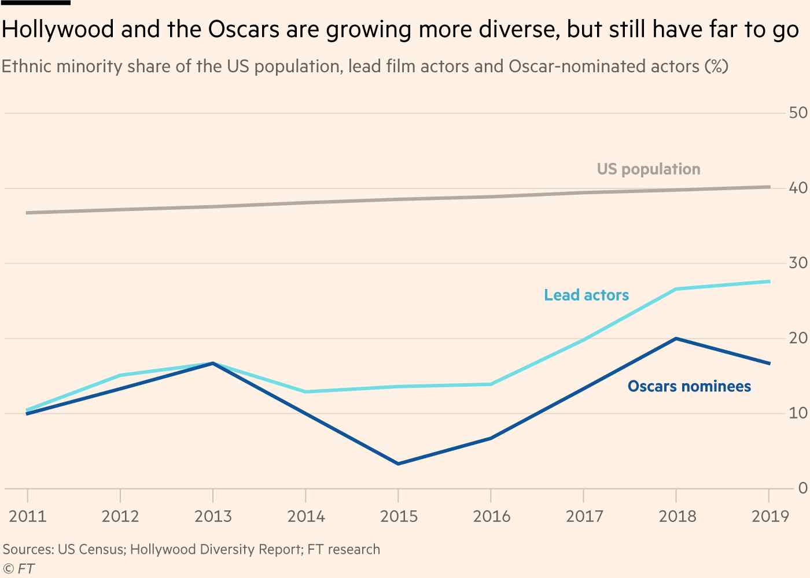

# Case study 2 – inequality in creative industries

# Introduction

Labour markets, as any other social formations, exhibit stratification. This
means workers (sharply) differ in terms of salary. Stratification can originate from several sources: ethnicity, religious beliefs, age, and gender.

This case study focuses on one specific source of stratification, namely, race. Particularly, the attention revolves around the association between race and extraordinary artistic/professional achievements in cultural markets – say consecration.

By analyzing a real-world datasets comprising firm-level data, you will contribute to inform the formulation of economic, organizational, and social policies that tackle on the problem of stratification in labour markets.

# Context for the case study

Over the past few years, both industry insiders and outsiders have pointed out that Hollywood, and, particularly, The Academy, has a diversity problem. Here's a passage from Feb 2020 article published in the Financial Times:

_Please use the sharing tools found via the share button at the top or side of articles. Copying articles to share with others is a breach of FT.com T&Cs and Copyright Policy. Email licensing@ft.com to buy additional rights. Subscribers may share up to 10 or 20 articles per month using the gift article service.

_Hollywood has a diversity problem and once a year during Oscar season it enters the international consciousness. Every year the overwhelming majority of those shortlisted is white, and away from the acting gongs, where gender parity is ensured, men also tend to dominate._

_In recent years, the predominant whiteness of nominees has sparked outcries on both sides of the Atlantic. The 2015 awards marked the second year in a row in which not one non-white actor was nominated in any of the four acting categories._

_In 2019, ethnic minorities made up just over 40 per cent of the US population, 33 per cent of mainstream film roles, and just 17 per cent of Oscars nominees in the five years since 2016 — an underrepresentation ratio of more than two to one._

The existence of serious inequality issues are self-evident in the below displayed chart.

Source: FT – more information can be found at https://www.ft.com/tour.
https://www.ft.com/content/ca2e8368-48e6-11ea-aeb3-955839e06441_

# Problem to address

The mounting conversation on inequality issues in Hollywood – along with some signals of changes already included in the data – may create ecological favor for diversity. You're supposed to build a dashboard/some interactive viz that helps movie executives to address the following question: "considering the allocation of accolades such as the Oscar, what are the expected onsequences of assigning the 'next' prominent role to a minority actor?"

# Data

Address the question by drawing on the publicly available dataset included in this [Kaggle project](https://www.kaggle.com/fmejia21/demographics-of-academy-awards-oscars-winners).
