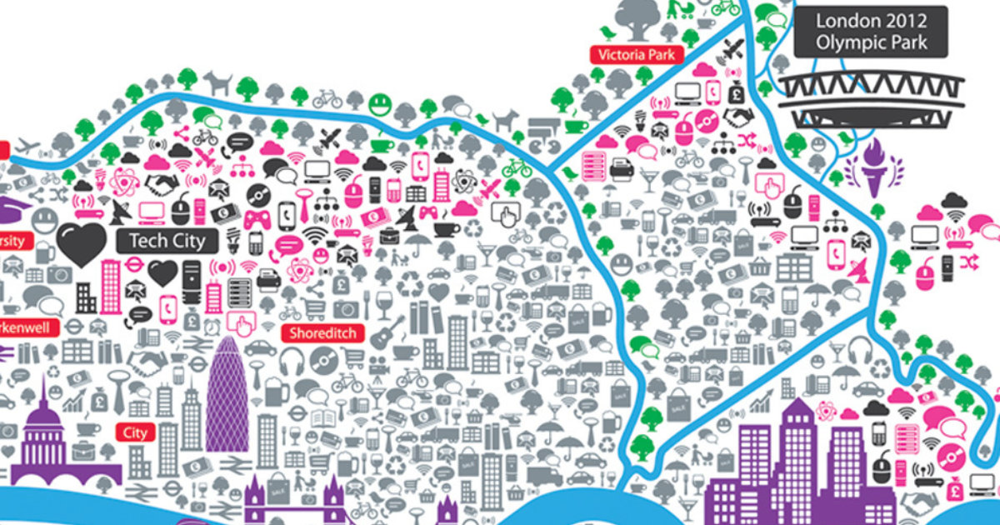

# Final course project (on the genesis and transformation of Tech City) – README

<!-- TOC -->

- [Final course project (on homophily, closure, and performance)– README](#final-course-project-on-homophily-closure-and-performance-readme)
- [Introduction](#introduction)
- [Problem to address](#problem-to-address)
- [Background for the case study](#background-for-the-case-study)
- [Data](#data)
  - [Dataset 1 – technology supply network in Formula 1](#dataset-1--technology-supply-network-in-formula-1)
    - [Source](#source)
    - [Data tables](#data-tables)
    - [Data analysis tips](#data-analysis-tips)
  - [Dataset 2 – founding teams in the UK economy](#dataset-2--founding-teams-in-the-uk-economy)
    - [Source](#source-1)
    - [Data tables](#data-tables-1)
    - [Data analysis tips](#data-analysis-tips-1)
  - [Dataset 3 – mobility network among professional football players](#dataset-3--mobility-network-among-professional-football-players)
    - [Source](#source-2)
    - [Data tables](#data-tables-2)
    - [Data analysis tips](#data-analysis-tips-2)
  - [Dataset 4 – collaboration and performance in hip hop music](#dataset-4--collaboration-and-performance-in-hip-hop-music)
    - [Source](#source-3)
    - [Data tables](#data-tables-3)
    - [Data analysis tips](#data-analysis-tips-3)
- [Deliverables](#deliverables)

<!-- /TOC -->

# Introduction

This final course project deals with the genesis and the transformation of Tech City (aka Silicon Roundabout), one of the most prominent technology-based clusters in the world.

# Problem to address

The students are required to jointly use geospatial analysis and dynamic visualization to represent the emergence and transformation of Tech City. The audience is difficult to frame – the visualization should be included in a blog talking about digital technologies and societies.

# Background for the case study

To deliver the project, students may want to:

- conduct a qualitative/historical investigation of the history of Tech city
- appreciate the existence of key events or policy making decisions that could have represented turning points in the lifecycle of Tech City

# Data

## Source

Data come from the archives of Companies House. Regarding data access:

- company-level data on UK-based businesses can be retrieved from the archived of [Free Company Data Product](http://download.companieshouse.gov.uk/en_output.html)
- founder-level data can be retrieved from the archive [People with
  significant control(PSC)](http://download.companieshouse.gov.uk/en_pscdata.html) snapshot

## Data tables

Key information about the data and users guidance are available in the
[Companies
House](https://www.gov.uk/guidance/companies-house-data-products#comp-data)
website and in this [companion
document](https://assets.publishing.service.gov.uk/government/uploads/system/uploads/attachment_data/file/426891/uniformResourceIdentifiersCustomerGuide.pdf).

# Deliverables

Students are required to submit:

1. a html file with the proposed visualization(s)
2. the code/data necessary to reproduce the visualization
3. a companion document that explains the background for the visualization (e.g., literature, white papers, technical reports, design decisions)

Upload the slideshow via Moodle by December 17 (16:00).
